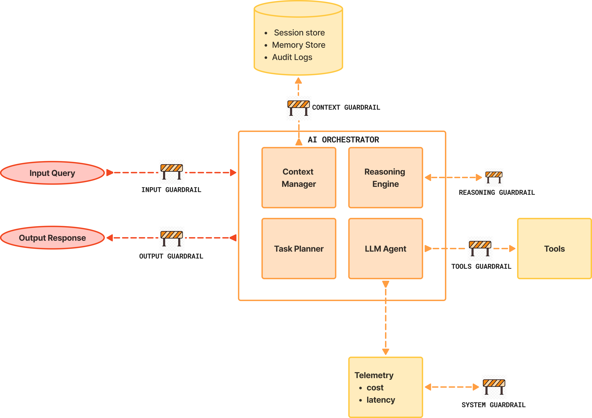

# Guardrails in Enterprise Agentic AI

Agentic AI guardrails are **safety mechanisms and governance frameworks** designed to ensure autonomous AI systems behave predictably, ethically, and within enterprise policy constraints. Unlike simple “safety prompts” or guidelines, guardrails are **enforceable controls** embedded into the AI system’s lifecycle—shaping behavior before, during, and after execution. They help prevent harmful or undesirable actions by agents that operate across data sources, tools, and external systems [2].

## 1. Why Guardrails Exist 

Enterprises increasingly deploy agentic systems to automate complex, multi-step tasks and optimize operations. But **governing these systems is uniquely challenging** because:

* Agents can take actions with real-world impact without explicit human instruction
* The logic that drives decisions is probabilistic and dynamic, making outcomes hard to predict or verify
* Traditional access controls and static policies are often insufficient to constrain dynamic decisions
* Regulatory requirements (e.g., data protection, auditability) demand clear accountability structures [3].

---

## 2. What Guardrails Are (and Are Not)

### Guardrails ARE

* Deterministic control layers around probabilistic systems
* Constraints on *inputs, reasoning, actions, and outputs*
* Enforceable policies, not suggestions
* Independent of model intelligence [1]

### Guardrails are NOT

* Prompt instructions alone
* “Be safe” system messages
* Compliance documents
* Human review everywhere

> **If a guardrail can be bypassed by a prompt, it is not a guardrail.**

---

## 3. Why Guardrails Are Non-Negotiable in Agentic AI

Agentic systems:

* Plan multiple steps
* Call tools
* Modify state
* Act asynchronously
* Accumulate errors

This introduces **compound risk**:

* One small hallucination → incorrect tool call
* Incorrect tool call → real-world action
* Real-world action → financial / legal / reputational damage

Guardrails are the **only mechanism that breaks error compounding**.

---

## 4. The Guardrail Stack (Layered by Design)

The diagram shows the guardrails layered in an Enterprise Agentic AI architecture.

### Layer 1: Input Guardrails (Pre-Reasoning)

**Purpose:** Control *what the system is allowed to consider*

Controls:

* Prompt sanitization
* PII / PHI detection
* Jailbreak detection
* Input length & complexity caps
* Role-based intent validation

Enterprise insight:

> Most catastrophic failures begin with **unvalidated input**, not bad reasoning.

---

### Layer 2: Context Guardrails (Knowledge & Memory)

**Purpose:** Control *what knowledge influences decisions*

Controls:

* Whitelisted data sources
* Versioned knowledge bases
* Context window constraints
* Memory expiration policies
* Tenant isolation (critical in multi-tenant systems)

Failure mode without this:

* Stale policy advice
* Cross-customer data leakage
* “Phantom facts” from old embeddings

---

### Layer 3: Reasoning Guardrails (Cognitive Constraints)

**Purpose:** Control *how the agent reasons*

Controls:

* Step limits (max reasoning depth)
* Plan validation before execution
* Mandatory justification checks
* Confidence thresholds
* Deterministic sub-tasks for critical steps

Key principle:

> You do not trust free-form reasoning in high-risk paths.

---

### Layer 4: Action Guardrails (Tool & Execution Control)

**Purpose:** Control *what the agent is allowed to do*

This is the **most critical layer**.

Controls:

* Tool allowlists / denylists
* Parameter constraints
* Rate limits
* Transaction caps
* Dry-run / simulation mode
* Dual-control for irreversible actions

Enterprise rule:

> **No agent should have unrestricted tool access—ever.**

---

### Layer 5: Output Guardrails (Post-Reasoning)

**Purpose:** Control *what leaves the system*

Controls:

* Schema validation
* Toxicity / bias detection
* Policy compliance checks
* Redaction
* Confidence tagging
* Safe-completion overrides

Output guardrails protect:

* Customers
* Brand
* Legal exposure

---

### Layer 6: System Guardrails (Meta-Control)

**Purpose:** Control *the AI system itself*

Controls:

* Kill switches
* Cost ceilings
* Runtime anomaly detection
* Drift detection
* Emergency downgrade (agent → RAG → static response)

This layer answers:

> “What happens when everything else fails?”

---

## 4. Guardrails vs Human-in-the-Loop (Critical Distinction)

| Aspect      | Guardrails    | Human-in-the-Loop |
| ----------- | ------------- | ----------------- |
| Nature      | Deterministic | Judgment-based    |
| Speed       | Instant       | Slow              |
| Scalability | High          | Low               |
| Cost        | Fixed         | Variable          |
| Reliability | Consistent    | Inconsistent      |

* Guardrails handle **known risks**
* Humans handle **unknown edge cases**

## Conclusion

Agentic AI represents a transformative evolution in enterprise automation. However, deploying autonomous systems without robust guardrails exposes organizations to unacceptable risk. Guardrails—when architected as **layered controls integrated into governance frameworks**—ensure that agentic AI remains safe, compliant, and aligned with strategic objectives.

By proactively designing and enforcing these controls, enterprises can unlock the benefits of agentic AI. Thus, maintaining operational integrity, building trust with stakeholders, and ensuring long-term resilience in an era of rapidly advancing autonomous technologies [1].

[1]: https://frontegg.com/blog/ai-agent-governance-starts-with-guardrails?utm_source=chatgpt.com "AI Agent Governance Starts with Guardrails"
[2]: https://www.ibm.com/think/topics/ai-guardrails?utm_source=chatgpt.com "What Are AI Guardrails?"
[3]: https://www.teksystems.com/en-hk/insights/article/agentic-ai-governance?utm_source=chatgpt.com "4 Best Practices for Robust Agentic AI Governance"
