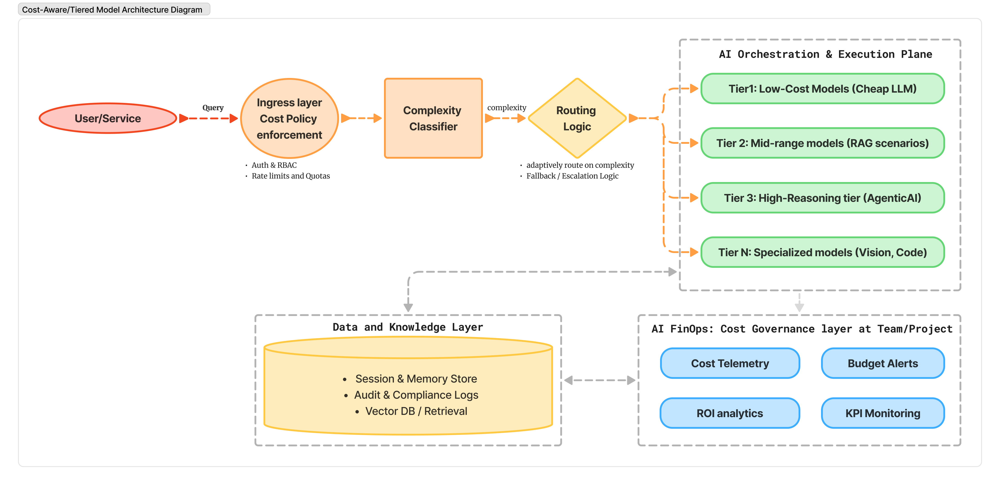

# **Cost-Aware / Tiered Models AI Architecture: A blueprint for Scalable, Responsible Enterprise AI Governance**

> **Cost-aware / tiered models** refer to a disciplined architectural and operational approach that aligns *AI model selection and invocation strategies* with *business value, performance requirements, and financial constraints*. This is especially critical in enterprise deployments where demand, stakes, and resource consumption scale rapidly.

---

## **Why Cost Matters in AI Architectures**

Unlike traditional software systems where infrastructure costs are relatively proportional to load and predictable, **AI — especially generative AI and agentic systems — exhibits different cost dynamics**:

* **Token-based billing:** LLM usage is often charged per token for inputs and outputs, meaning every extra token dramatically increases spend. Longer conversations or verbose prompts amplify costs linearly [1].
* **Model tier pricing:** Higher-capacity models (e.g., GPT-4-equivalents) are significantly more expensive per inference than smaller, specialized counterparts [2].
* **Agent execution loops:** Autonomous agents that chain tools, recursive prompts, or multi-step reasoning can generate exponential cost growth if not properly bounded [1].

**Without intentional cost modeling**, enterprises risk unbounded monthly AI bills, budget overruns, and resource allocations that fail to correlate with business outcomes.

---

## **Principles of Cost-Aware Model Architecture**

Enterprise-grade cost awareness is not merely financial — it’s a **design principle embedded into system architecture and runtime behavior**.

### **1. Cost as a First-Order Constraint**

Traditional architecture prioritizes performance, security, and reliability. In the cost-aware paradigm, **cost becomes a primary trade-off dimension** in architectural decisions, on par with correctness and latency [3].

This means the system must intelligently decide **when to use which model, at what time, for what purpose** — not simply defaulting to the most capable (and most expensive) model available.

---

## **2. Tiered Model Strategy — An Efficiency Multiplier**

The **tiered model approach** segments models into classes based on *cost, capability, and suitability* for different task profiles.

### **Typical Tiers**

| Tier                              | Purpose                                                      | Example                                   |
| --------------------------------- | ------------------------------------------------------------ | ----------------------------------------- |
| **Low-Cost / Lightweight Models** | Quick lookups, classification, filtering                     | Small retrievers, compact language models |
| **Mid-Tier Models**               | Structured generation, controlled creative tasks             | Moderately capable curated models         |
| **High-Tier Models**              | Deep reasoning, multi-step planning, high-accuracy inference | Large, high-accuracy LLMs                 |
| **Specialized Models**            | Domain-specific tasks (vision, speech, code)                 | Vision transformers, code models          |

Instead of always using the highest tier for every request, the architecture **routes requests to the lowest acceptable tier** that satisfies quality and SLA needs.

---

## **3. How Tiered Routing Works (Architecture Pattern)**

Think of tiering as an adaptive **model routing pipeline**:

1. **Analyzers / Classifiers** initially inspect input to estimate complexity.
2. **Routing logic** assigns the task to a model tier.
3. **Fallback escalation:** If confidence is low or quality is insufficient, the request is escalated to a higher tier.
4. **Budget profiling:** Each model tier has associated cost budgets and caps.

This is distinct from static selection — it’s **dynamic, adaptive, and workload-driven**.

---

### **Example: Tiered Routing for a Support Assistant**

An enterprise support bot might follow this pattern:

* **Tier 1 (Cheap):** Validate classification, short answers, rule-based FAQs.
* **Tier 2 (Moderate):** Mid-sized LLM for context handling and structured responses.
* **Tier 3 (Expensive):** High-capability model with multi-tool orchestration for complex problem solving.

By defaulting to Tier 1 or Tier 2 for most queries and only escalating ~10–15% of cases to Tier 3, the net inference cost is significantly reduced without user experience degradation [2].

---

## **Architectural Components for Cost-Aware AI**

A robust cost-aware system typically includes the following elements:

### **1. Model Selection / Routing Service**

A dedicated service that evaluates inputs and routes tasks to the appropriate model tier, based on:

* Estimated complexity
* Required accuracy
* Latency tolerances
* Business priority

---

### **2. Token & Context Management**

Long conversation histories or verbose responses drive up token costs. Techniques such as:

* **Token caps** (hard limits on input/output length)
* **Context pruning**
* **Selective retrieval insertion**
  help keep token usage — and cost — under control [1].

---

### **3. Observability & Cost Telemetry**

A central monitoring layer aggregates:

* Cost per model tier
* Average tokens per request
* Patterns of escalation
* Budget exhaustion warnings

This level of FinOps visibility is essential for proactive governance [4].

---

## **FinOps Integration — Financial Transparency & Accountability**

AI cost management often falls under an emerging discipline called **AI FinOps**, aimed at bringing financial accountability into AI operations.

Key FinOps practices for AI include:

* **Cost allocation:** Tagging AI calls by team, project, environment, or business unit [4].
* **Budget alerts:** Triggering warnings when spend approaches thresholds.
* **Chargeback models:** Ensuring teams own their AI consumption.
* **ROI analytics:** Mapping AI spend to business outcomes, not just raw usage metrics.

These practices elevate cost-aware design from a technical tweak to a **strategic operational discipline**.

---

## **Trade-Offs and Practical Considerations**

Adopting a cost-aware / tiered model architecture involves clear trade-offs:

* **Quality vs. Cost:** Lower tiers are cheaper but may be less capable. The routing logic must decide when quality justifies higher spend.
* **Latency vs. Efficiency:** Escalation steps add control but may increase response latency.
* **Complexity vs. Simplicity:** Tiered systems are more complex than monolithic models — but complexity yields better cost discipline.

Effective architectural patterns and monitoring mitigate these trade-offs.

---

## **Summary:**

1. **Cost is a design constraint, not an optimization afterthought.**
2. **Tiered models reduce unnecessary expensive invocations.**
3. **Routing logic must be adaptive and informed by context.**
4. **Monitoring + FinOps governance is essential.**
5. **Agentic AI orchestrators should internalize cost at runtime.**

When done right, cost-aware / tiered models make *enterprise AI both scalable and financially sustainable* — unlocking value without overspending.

---

[1]: https://www.cloudgeometry.com/blog/building-cost-aware-ai-systems-a-guide-for-both-technical-and-non-technical-decisions "Building Cost-Aware AI Systems: Strategies for Managing ..."
[2]: https://docs.aws.amazon.com/prescriptive-guidance/latest/agentic-ai-serverless/cost-optimization.html "Cost optimization - AWS Prescriptive Guidance"
[3]: https://thesciencebrigade.com/jst/article/view/22 "AI-Optimized Cost-Aware Design Strategies for Resource- ..."
[4]: https://holori.com/ai-cost-allocation-finops/ "AI Cost Allocation in FinOps: A Complete Guide to ..."
[5]: https://mgx.dev/insights/cost-aware-agent-orchestration-principles-mechanisms-impact-and-future-trends/fe94b2b9c726478facce312969b2a6de "Cost-Aware Agent Orchestration: Principles, Mechanisms ..."
