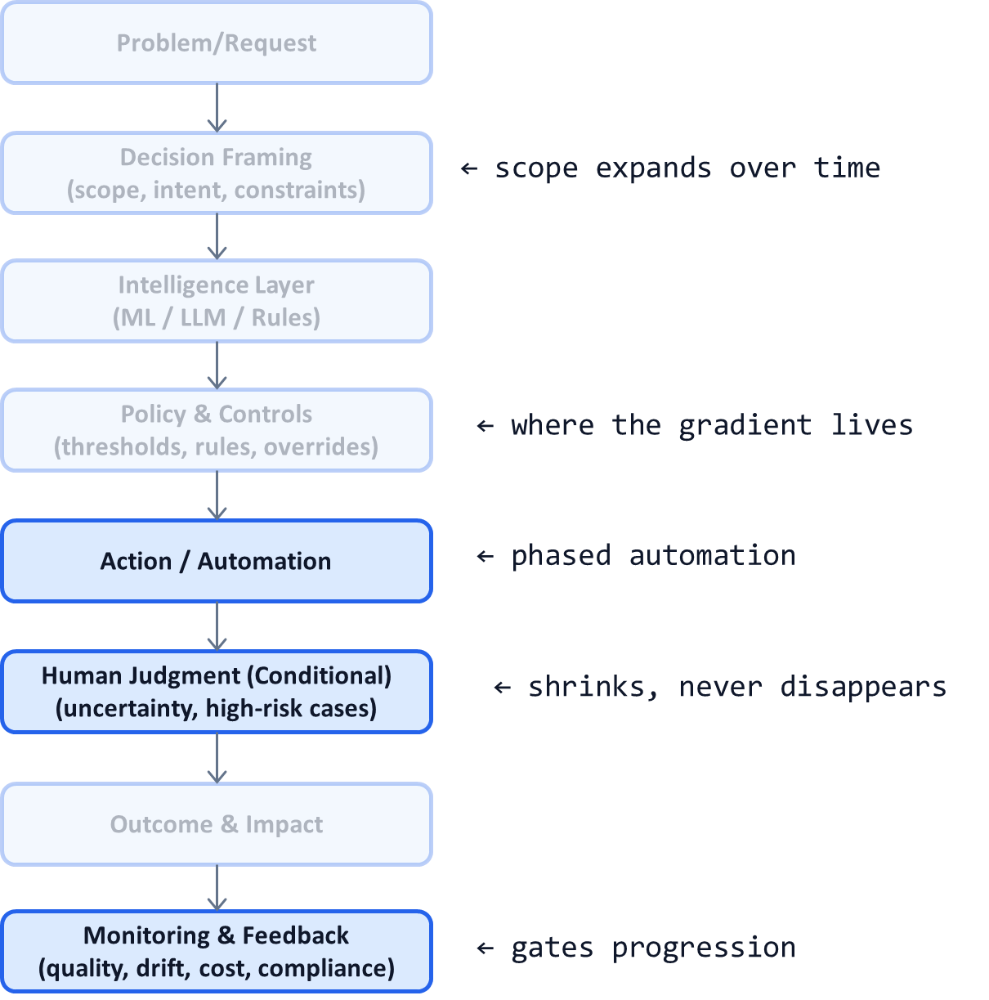

# AI System Diagnostic Pattern P02: Decision Support → Decision Automation Gradient

## Problem

Most AI systems fail because teams treat automation as a **binary choice**:
- Either “AI only assists”
- Or “AI fully automates”

This leads to predictable outcomes:
- Over-automation → risk, incidents, loss of trust
- Under-automation → no ROI, human overload, stalled adoption

In reality, **automation must be phased**, not flipped.

---

## Context

This pattern appears in:
- High-stakes decision systems (healthcare, finance, insurance)
- Early AI rollouts where trust is fragile
- Regulated or audited workflows
- LLM copilots moving toward autonomy

It is especially critical when:
- Error costs are asymmetric
- Edge cases dominate
- Humans are legally or ethically accountable

---

## Core Insight

**Automation is a gradient, not a switch.**

Effective AI systems deliberately move from:
- Decision support
→ Partial automation
→ Full automation with guardrails

Each stage expands *only after* the system proves reliability, economics, and trust.

---

## AI System Diagnostic Diagram 

**Key annotation:**
The automation gradient is **not** inside the model.
It lives in **Policy & Controls** and **Action**, gated by **Monitoring**.

---

## How the Gradient Works

### Phase 1 — Decision Support

* AI suggests options
* Human decides every time
* System learns error patterns

**Goal:** Trust calibration, not speed

---

### Phase 2 — Conditional Automation

* AI auto-decides low-risk cases
* Humans handle:

  * Low confidence
  * High impact
  * Novel patterns

**Goal:** ROI without losing control

---

### Phase 3 — Full Automation with Guardrails

* AI decides by default
* Humans:

  * Audit
  * Handle exceptions
  * Redefine policy

**Goal:** Scale with bounded risk

---

## Control Points (Non-Negotiable)

To implement this pattern, the system must expose:

* **Confidence thresholds**
  (what qualifies for automation)

* **Risk segmentation**
  (which decisions are never automated)

* **Override paths**
  (how humans intervene)

* **Rollback mechanisms**
  (how automation is reduced safely)

Without these, automation becomes reckless.

---

## Failure Modes if Ignored

If automation is treated as binary:

* Trust collapses after first incident
* Humans are bypassed or overwhelmed
* “AI mistakes” become political issues
* Systems get frozen at pilot stage

These failures are architectural, not model-related.

---

## Maturity Levels

**Level 1 – Assistive Only**

* Low risk
* Low ROI
* High manual cost

**Level 2 – Gradient-Based**

* Controlled automation
* Clear decision boundaries
* Growing trust

**Level 3 – Autonomous with Guardrails**

* High scale
* Stable operations
* Humans govern, not execute

Most successful AI systems plateau at Level 2 for a long time—and that is acceptable.

---

## Reusable Across

This pattern applies to:

* Medical coding and claims
* Fraud detection
* Content moderation
* Hiring and screening
* Enterprise copilots
* Agentic AI systems

Anywhere decisions have **uneven risk distribution**.

---

## Why This Pattern Compounds

This pattern:

* Accelerates adoption without backlash
* Makes automation defensible
* Creates executive confidence
* Allows safe scaling across use cases

It transforms AI from a **technical experiment** into a **governable decision system**.

---

## One-Sentence Summary

> **Effective AI systems do not choose between human or machine decisions—they deliberately move along a controlled automation gradient, gated by risk and trust.**
