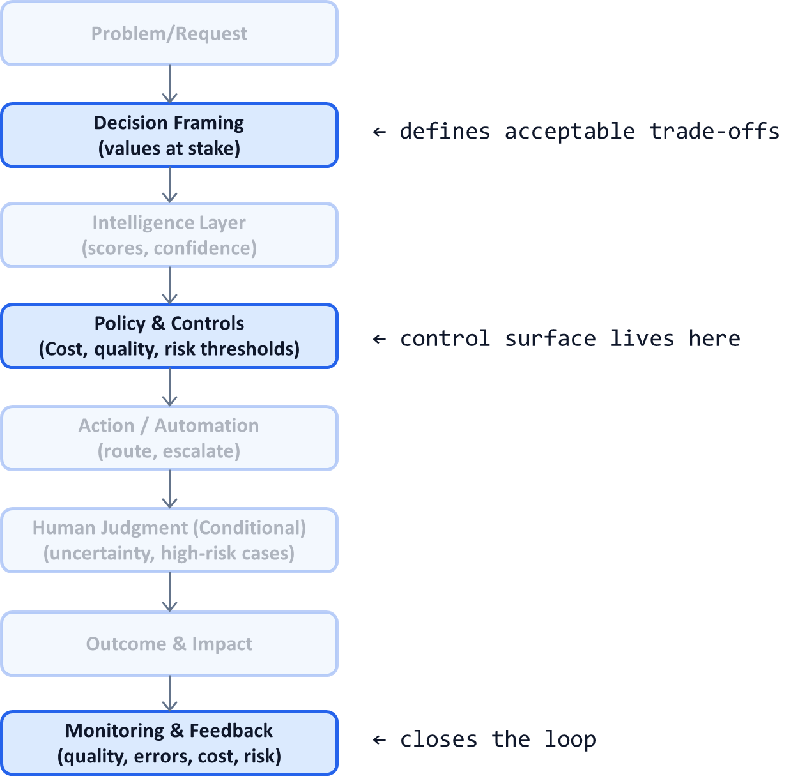

# AI System Diagnostic Pattern P04: Cost–Quality–Risk Control Surface

## Problem

Many AI systems optimize for a **single metric**—usually accuracy or precision.

This creates predictable failure modes:
- Models become too expensive to run
- Latency explodes at scale
- Rare but catastrophic errors are ignored
- Business teams cannot tune behavior without retraining

When cost, quality, and risk are implicit, AI systems become **uncontrollable at scale**.

---

## Context

This pattern appears in:
- Enterprise AI systems with real operating costs
- LLM-based workflows with token-based pricing
- Regulated decision systems with asymmetric error costs
- Any system moving from pilot to production

It becomes visible when:
- Finance asks for cost predictability
- Legal asks for risk limits
- Product asks for faster iteration
- Engineering is stuck retraining models for policy changes

---

## Core Insight

**AI decisions live on a trade-off surface, not a single axis.**

Every AI decision involves balancing:
- **Cost** (compute, latency, human review)
- **Quality** (accuracy, usefulness, consistency)
- **Risk** (financial, legal, reputational)

High-leverage systems make these trade-offs **explicit and tunable**.

---
## AI System Diagnostic Diagram 

This pattern lives primarily in the **Policy & Controls** layer and is enforced via **Monitoring**.

**Key annotation:**
Trade-offs are controlled **outside the model**, via policy thresholds informed by monitoring.

---

## How the Control Surface Works

Instead of one global threshold, the system exposes **knobs**:

### Cost Controls

* Max cost per decision
* Latency budgets
* Human review capacity
* Model selection by cost tier

### Quality Controls

* Minimum confidence for automation
* Task-specific accuracy targets
* Degradation tolerance

### Risk Controls

* Decisions never automated
* Escalation rules for high-impact cases
* Conservative thresholds for rare events

These controls allow behavior changes **without retraining**.

---

## Concrete Example (Generic)

* Low-value, low-risk cases
  → Cheap model, aggressive automation

* Medium-value cases
  → Better model, conditional human review

* High-risk or irreversible decisions
  → Conservative thresholds, mandatory human sign-off

Same intelligence.
Different policy.

---

## Control Points (What Must Be Explicit)

A system implementing this pattern must define:

* Error cost curves (not just error rates)
* Which mistakes matter more than others
* Where cost savings are acceptable
* Where risk must be minimized at all costs

If these are undocumented, the system is unmanaged.

---

## Failure Modes if Ignored

When cost–quality–risk trade-offs are implicit:

* Systems are “accurate but unusable”
* Costs explode silently
* Risk accumulates unnoticed
* Every change becomes a technical debate
* Business teams lose confidence in AI

These systems stall or get shut down.

---

## Maturity Levels

**Level 1 – Metric-Driven**

* Single accuracy metric
* No cost visibility
* Risk discovered post-hoc

**Level 2 – Threshold-Driven**

* Some explicit rules
* Partial cost awareness
* Manual risk handling

**Level 3 – Control-Surface-Driven**

* Explicit trade-offs
* Tunable policies
* Continuous monitoring
* Predictable economics

Production-grade AI requires Level 3.

---

## Reusable Across

This pattern applies to:

* LLM agents and copilots
* Classification and ranking systems
* Fraud and anomaly detection
* Medical coding and claims
* Pricing and eligibility decisions

Anywhere **errors are unequal and scale matters**.

---

## Why This Pattern Compounds

Making trade-offs explicit:

* Aligns AI with business reality
* Enables safe scaling
* Reduces political friction
* Speeds iteration
* Allows AI portfolios to be managed economically

This is where AI becomes a **managed asset**, not a science project.

---

## One-Sentence Summary

> **Every AI decision balances cost, quality, and risk. High-leverage systems expose these trade-offs as a controllable surface instead of hiding them inside models.**