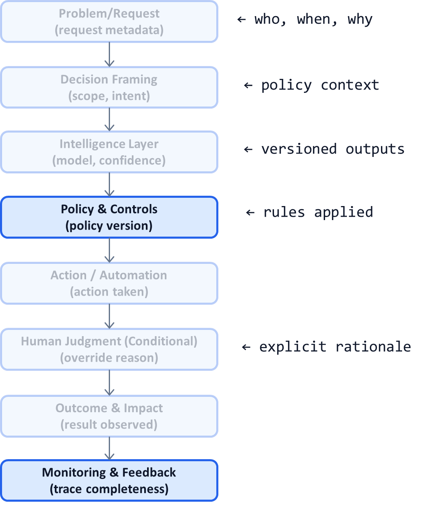

# AI System Diagnostic Pattern P07: Audit-First AI Design

## Problem

Many AI systems attempt to add explainability **after deployment**:
- Logs are incomplete
- Prompts and policies are undocumented
- Model versions are unclear
- Human interventions are not captured

When auditors, regulators, or executives ask *“Why did this decision happen?”*, teams cannot answer with confidence.

Post-hoc explanations fail because **auditability was not designed into the system**.

---

## Context

This problem appears in:
- Regulated and compliance-heavy domains
- Enterprise AI platforms
- LLM-based decision systems
- Any workflow with accountability requirements

It becomes visible when:
- Incidents trigger investigations
- Customers challenge decisions
- Legal or compliance teams request evidence
- Model upgrades invalidate historical explanations

---

## Core Insight

**If a decision cannot be reconstructed, it cannot be defended.**

Auditability is not an add-on.  
It is a **design principle** that must be embedded at every decision boundary.

AI systems should emit evidence *by default*, not generate explanations on demand.

---

## AI System Diagnostic Diagram 

This pattern instruments **every stage of the system** to leave an audit trail.

**Key annotation:**
Audit data is emitted **inline**, not reconstructed later.

---

## How the Pattern Works

An audit-first system ensures that **every decision produces a structured trace** containing:

* Input context (sanitized as required)
* Model identifier and version
* Confidence or uncertainty signals
* Policy version and thresholds applied
* Action taken
* Human intervention (if any) and rationale
* Final outcome (when available)

This trace is immutable and queryable.

---

## Control Points (What Must Be Explicit)

Audit-first design requires explicit definitions for:

* What constitutes a “decision”
* What evidence must be captured per decision
* How long audit data is retained
* Who can access or review it
* How privacy and compliance are enforced

If evidence requirements are unclear, audits will fail.

---

## Failure Modes if Ignored

When auditability is retrofitted:

* Historical decisions cannot be explained
* Investigations rely on inference and guesswork
* Trust collapses during incidents
* AI usage is restricted or rolled back
* Teams become afraid to evolve systems

These failures are organizationally expensive.

---

## Maturity Levels

**Level 1 – Reactive Logging**

* Partial logs
* Manual reconstruction
* Inconsistent explanations

**Level 2 – Structured Tracing**

* Decision-level logs
* Versioned components
* Limited human rationale capture

**Level 3 – Audit-First**

* Complete decision traces
* Policy and model versioning
* Human overrides captured explicitly
* Ready for audit at any time

Serious AI systems operate at Level 3.

---

## Reusable Across

This pattern applies to:

* Healthcare and insurance AI
* Financial and credit systems
* Content moderation and enforcement
* Enterprise decision platforms
* Agentic AI with tool execution

Anywhere decisions must be **explained, defended, or appealed**.

---

## Why This Pattern Compounds

Audit-first design:

* Builds regulator and executive confidence
* Reduces incident response time
* Enables safer experimentation
* Supports continuous improvement
* Turns AI into a trusted system of record

It is a prerequisite for scaling AI responsibly.

---

## One-Sentence Summary

> **If an AI decision cannot be reconstructed with evidence, it cannot be trusted—auditability must be designed in from the start.**

