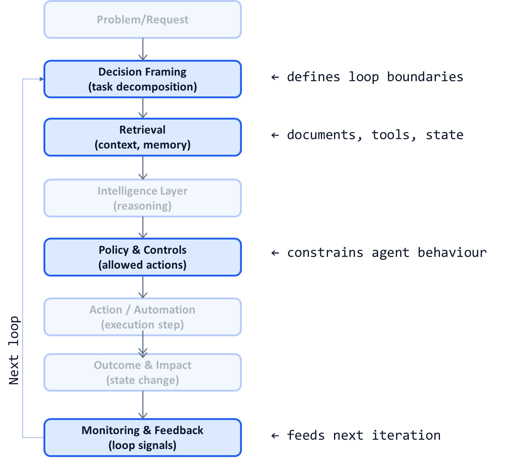

# AI System Diagnostic Pattern P08: Agentic Retrieval–Reasoning–Action Feedback Loop

## Problem

Many AI systems are designed as **single-shot predictors**:
- One input
- One model call
- One output

This works for narrow tasks, but breaks down when:
- Context is incomplete or distributed
- Decisions require multiple steps
- Actions change the environment
- Learning must occur over time

Single-shot AI produces brittle behavior.  
Real-world intelligence requires **loops**.

---

## Context

This pattern appears in:
- LLM-based agents and copilots
- Operational AI systems
- Research, investigation, and triage workflows
- Any AI that must act, observe, and adapt

It becomes visible when:
- AI gives plausible but wrong answers due to missing context
- Systems cannot recover from partial failure
- Automation stalls because “the model already answered”
- Learning from outcomes is manual and delayed

---

## Core Insight

**Intelligent systems do not just predict. They iterate.**

Effective AI systems follow a loop:
1. Retrieve relevant context
2. Reason over it
3. Take action
4. Observe outcomes
5. Feed results back into the next decision

This loop—not the model—is the unit of intelligence.

---

## AI System Diagnostic Diagram 

This pattern **wraps the canonical system into a closed loop** driven by feedback.

**Key annotation:**
Intelligence emerges from **repeated controlled loops**, not a single inference.

---

## How the Loop Works

### 1. Retrieval

* Pull relevant documents
* Query tools or APIs
* Load memory or state

Goal: reduce hallucination by grounding reasoning.

---

### 2. Reasoning

* Synthesize retrieved context
* Decide next step
* Generate intermediate conclusions

Goal: plan, not just answer.

---

### 3. Action

* Execute a constrained action:

  * Call a tool
  * Update a record
  * Ask for human input
  * Produce a recommendation

Goal: change the environment intentionally.

---

### 4. Observation & Feedback

* Capture:

  * Action result
  * Errors
  * Latency
  * Human overrides

Goal: inform the next iteration.

---

## Control Points (Critical for Safety)

In agentic loops, control must be explicit:

* Maximum loop depth
* Allowed action types
* Escalation to humans (P05)
* Cost and latency budgets (P04)
* Fail-safe exits (P06)
* Audit traces per step (P07)

Without these, loops become runaway systems.

---

## Failure Modes if Ignored

When systems lack proper loops:

* AI answers confidently with missing context
* Errors compound across steps
* Systems cannot self-correct
* Humans must restart workflows manually
* Trust degrades rapidly

When loops exist without controls:

* Infinite or wasteful cycles
* Unexpected actions
* Cost explosions
* Safety incidents

---

## Maturity Levels

**Level 1 – Single-Shot**

* One inference per request
* No state or learning
* Fragile behavior

**Level 2 – Shallow Loop**

* Limited retrieval
* Few iterations
* Partial feedback

**Level 3 – Controlled Feedback Loop**

* Explicit loop boundaries
* Policy-constrained actions
* Continuous learning signals

Agentic AI systems require Level 3.

---

## Reusable Across

This pattern applies to:

* AI copilots
* Research assistants
* Claims and case investigation
* DevOps and IT automation
* Knowledge-intensive workflows
* Multi-step decision agents

Anywhere decisions unfold over time.

---

## Why This Pattern Compounds

Well-designed loops:

* Increase accuracy without better models
* Reduce hallucination
* Enable learning from outcomes
* Support gradual autonomy
* Turn AI into an adaptive system

This pattern is the backbone of **scalable agentic AI**.

---

## One-Sentence Summary

> **Real AI systems do not think once—they retrieve, reason, act, observe, and repeat under explicit control.**