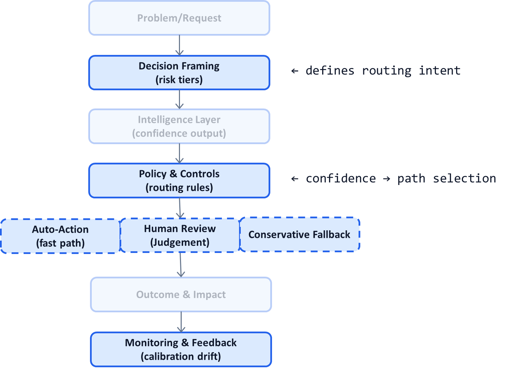

# AI System Diagnostic Pattern P09: Confidence-Calibrated Routing

## Problem

Most AI systems compute confidence but **do nothing structural with it**.

Typical anti-patterns:
- Confidence is logged but ignored
- One global threshold is applied everywhere
- Humans review random samples instead of uncertain cases
- Low-confidence outputs still trigger irreversible actions

When uncertainty does not influence system flow, AI behaves as if it were always certain—which is dangerous.

---

## Context

This pattern appears in:
- High-volume decision systems
- Agentic AI with multiple action paths
- Human-in-the-loop workflows
- Any system where error cost is uneven

It becomes visible when:
- Review queues are misaligned with risk
- Incidents occur despite “confidence scores”
- Automation rates are either too low or reckless
- Teams argue about thresholds without system context

---

## Core Insight

**Uncertainty should route decisions, not just annotate them.**

Confidence is not an output metric.  
It is a **control signal** that determines:
- Which path the system takes
- Whether humans are involved
- How conservative the system should be
- Which resources are spent

Systems that treat confidence as data waste leverage.

---

## AI System Diagnostic Diagram 

This pattern turns confidence into a **routing mechanism inside Policy & Controls**.

**Key annotation:**
Confidence determines *which path executes*, not just *how confident we feel*.

---

## How the Pattern Works

### Step 1 — Produce Meaningful Confidence

* Probabilistic scores
* Disagreement between models
* Entropy or margin measures
* OOD / novelty signals

Confidence must correlate with correctness, not just model belief.

---

### Step 2 — Define Routing Policies

Examples:

* High confidence + low risk → auto-action
* Medium confidence → human review
* Low confidence or high impact → conservative fallback

Routing rules are **policy**, not model logic.

---

### Step 3 — Tune Per Decision Class

Different decisions require different confidence regimes:

* Reversible vs irreversible
* Low value vs high value
* Frequent vs rare

One threshold never fits all.

---

### Step 4 — Continuously Recalibrate

Monitor:

* Confidence vs actual error
* Override frequency
* Drift by segment
* Cost per routed path

Calibration is ongoing, not one-time.

---

## Control Points (What Must Be Explicit)

A confidence-calibrated system defines:

* What confidence means (semantics)
* How it is computed
* Routing thresholds per decision class
* Fallback behaviors
* Ownership of calibration drift

If teams argue about confidence after incidents, this was not explicit.

---

## Failure Modes if Ignored

Without confidence-based routing:

* Humans review the wrong cases
* Automation feels arbitrary
* Rare failures slip through
* Costs scale inefficiently
* Trust degrades despite “high accuracy”

Without calibration:

* Overconfident models cause harm
* Conservative models destroy ROI

Both failures are systemic.

---

## Maturity Levels

**Level 1 – Confidence as Metadata**

* Logged only
* No routing impact

**Level 2 – Global Threshold**

* Some routing
* Poor segmentation
* Frequent misalignment

**Level 3 – Calibrated Routing**

* Per-decision thresholds
* Continuous recalibration
* Tight cost–risk alignment

High-scale AI systems require Level 3.

---

## Reusable Across

This pattern applies to:

* Medical coding and claims
* Fraud detection
* Content moderation
* Enterprise copilots
* Agentic AI workflows
* Recommendation and ranking systems

Anywhere uncertainty varies materially.

---

## Why This Pattern Compounds

Confidence-calibrated routing:

* Maximizes automation safely
* Minimizes unnecessary human effort
* Aligns cost with risk
* Improves trust
* Enables other patterns (P02, P05, P08)

It is one of the highest ROI architectural patterns.

---

## One-Sentence Summary

> **In production AI systems, confidence should determine what happens next—not just how results are labeled.**

