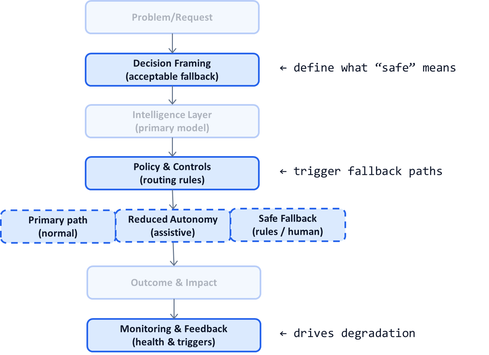

# AI System Diagnostic Pattern P10: Graceful Degradation and Safe Fallbacks

## Problem

Most AI systems assume steady-state conditions:
- Stable data distributions
- Predictable loads
- Reliable dependencies
- Calibrated confidence

When these assumptions fail, systems often:
- Continue operating blindly
- Fail hard and abruptly
- Produce confident but wrong outputs
- Require manual shutdowns

In production, **failure is inevitable**. What matters is **how the system degrades**.

---

## Context

This pattern is critical in:
- High-volume production AI
- Agentic systems with tool dependencies
- Cost-sensitive LLM workflows
- Regulated or customer-facing decisions

It becomes visible when:
- Data drift increases
- Confidence calibration degrades
- External services fail or slow down
- Costs spike unexpectedly
- Incident response is reactive and manual

---

## Core Insight

**A resilient AI system degrades capability before it degrades trust.**

Graceful systems:
- Reduce autonomy before making unsafe decisions
- Fall back to simpler, safer behavior
- Preserve correctness and auditability over performance

Catastrophic systems optimize for speed until they fail.

---

## AI System Diagnostic Diagram 

This pattern adds **explicit fallback paths** and **degradation controls** to the system.

**Key annotation:**
Fallback behavior is **designed and tested**, not improvised during incidents.

---

## How the Pattern Works

### Step 1 — Define Degradation Triggers

Examples:

* Confidence calibration drift (P09)
* Latency or timeout breaches
* Cost per decision exceeding budget (P04)
* Dependency failures
* Spike in human overrides (P05)

Triggers must be **objective and measurable**.

---

### Step 2 — Define Degradation Levels

Common levels include:

* **Level A:** Full automation
* **Level B:** Assistive only
* **Level C:** Conservative rules
* **Level D:** Human-only or block

Each level trades performance for safety intentionally.

---

### Step 3 — Predefine Safe Fallbacks

Fallbacks may include:

* Simpler heuristic rules
* Smaller or cheaper models
* Mandatory human review
* Partial service disablement

The fallback must be:

* Predictable
* Auditable
* Legally defensible

---

### Step 4 — Recover Gradually

Once conditions stabilize:

* Recalibrate confidence
* Restore autonomy incrementally
* Validate metrics before promotion

Recovery is **phased**, not instant.

---

## Control Points (Non-Negotiable)

A system implementing this pattern must specify:

* Degradation triggers
* Allowed fallback modes
* Authority to change modes
* Communication to stakeholders
* Audit traces per mode switch

If mode changes surprise operators, the system is unsafe.

---

## Failure Modes if Ignored

Without graceful degradation:

* Systems fail silently
* Emergency shutdowns become common
* Humans scramble reactively
* Trust collapses after incidents
* Automation is rolled back permanently

These systems rarely regain autonomy.

---

## Maturity Levels

**Level 1 – No Fallback**

* Optimistic operation
* Hard failures

**Level 2 – Manual Fallback**

* Ad-hoc intervention
* Slow response

**Level 3 – Designed Degradation**

* Automatic mode switching
* Safe defaults
* Controlled recovery

Production-grade AI systems require Level 3.

---

## Reusable Across

This pattern applies to:

* LLM-based agents
* Fraud and risk systems
* Medical and insurance workflows
* Recommendation systems
* Enterprise AI platforms

Anywhere **conditions vary faster than models can adapt**.

---

## Why This Pattern Compounds

Graceful degradation:

* Prevents catastrophic incidents
* Preserves trust during stress
* Enables higher baseline automation
* Reduces operational panic
* Complements P06 (failure-mode–first)

It is a prerequisite for resilient AI at scale.

---

## One-Sentence Summary

> **Resilient AI systems do not fail abruptly—they deliberately degrade to safer modes before trust is lost.**

