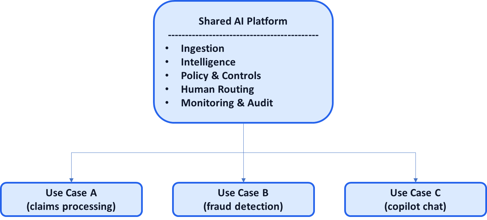

# AI System Diagnostic Pattern P11: AI as a Platform, Not a Project

## Problem

Most organizations treat AI as a sequence of **projects**:
- One use case at a time
- Custom pipelines per team
- Isolated models and dashboards
- Repeated governance debates

This produces predictable outcomes:
- Slow delivery
- Duplicated effort
- Inconsistent quality and risk
- No compounding value

AI works once—but never twice the same way.

---

## Context

This pattern becomes critical when:
- Multiple AI use cases exist across teams
- LLM usage spreads organically
- Governance and compliance requirements increase
- Costs become visible at scale

It is especially relevant in:
- Enterprises with shared data and workflows
- Product organizations shipping multiple AI features
- Platform teams supporting many consumers

---

## Core Insight

**AI compounds only when shared capabilities are centralized and reused.**

Projects deliver features.  
Platforms deliver **leverage**.

Treating AI as a platform means:
- Common foundations
- Consistent controls
- Reusable patterns
- Decentralized innovation on a stable core

---

## AI System Diagnostic Diagram 

This pattern **lifts the canonical system from a single workflow to an organizational layer**.

**Key annotation:**
The **platform implements patterns** (P02–P10); use cases configure them.

---

## How the Platform Pattern Works

### 1. Centralize the Hard Parts

The platform owns:

* Data ingestion and normalization
* Model access and versioning
* Policy enforcement (P03)
* Cost–quality–risk controls (P04)
* Human routing (P05)
* Monitoring, audit, and fallback (P06–P10)

These should not be re-implemented per use case.

---

### 2. Decentralize Use-Case Logic

Individual teams control:

* Decision framing
* Domain-specific thresholds
* UX and integration
* Business metrics

Teams move fast **without bypassing controls**.

---

### 3. Enforce Patterns by Default

Patterns are not optional guidelines; they are **built-in primitives**:

* Automation gradients
* Confidence routing
* Audit traces
* Degradation modes

If a use case exists, it inherits these behaviors automatically.

---

## Control Points (Organizational)

A platform approach requires explicit ownership of:

* Who can deploy models
* Who defines policies
* How costs are allocated
* How incidents are handled
* How changes propagate across use cases

Without clear ownership, platforms decay into shared messes.

---

## Failure Modes if Ignored

When AI remains project-based:

* Each use case reinvents the wheel
* Risk reviews happen repeatedly
* Costs are unpredictable
* Model sprawl accelerates
* Trust erodes as behaviors diverge

Organizations stall after early wins.

---

## Maturity Levels

**Level 1 – Project-Based**

* One-off builds
* Manual governance
* No reuse

**Level 2 – Shared Components**

* Partial reuse
* Inconsistent controls
* Platform by convention

**Level 3 – Platform-Driven**

* Standardized patterns
* Clear ownership
* Self-service for teams
* Compounding value

AI leaders operate at Level 3.

---

## Reusable Across

This pattern applies to:

* Enterprise AI programs
* Product organizations
* LLM enablement teams
* Internal AI platforms
* Vertical AI companies

Anywhere AI must scale beyond a single team.

---

## Why This Pattern Compounds

AI platforms:

* Reduce marginal cost of new use cases
* Increase consistency and trust
* Shorten delivery timelines
* Simplify governance
* Create organizational leverage

This is how AI becomes infrastructure, not experimentation.

---

## One-Sentence Summary

> **AI delivers compounding value only when treated as a shared platform that enforces reusable patterns, not as a series of disconnected projects.**

