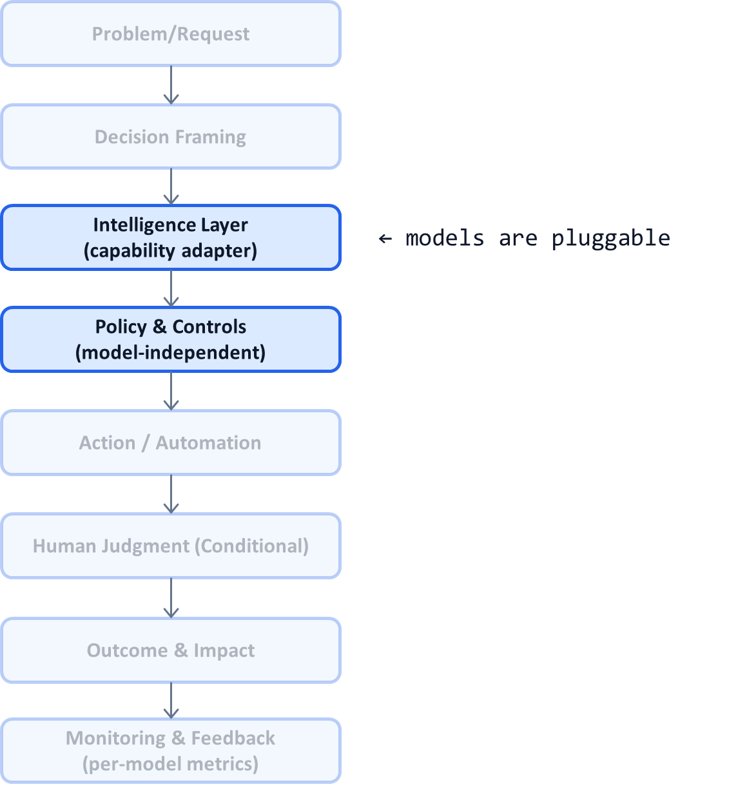

# AI System Diagnostic Pattern: Model-Agnostic System Design

## Problem

AI systems are often tightly coupled to a specific model or vendor:
- Business logic embedded in prompts
- Model-specific features leaking into workflows
- Upgrades breaking behavior unexpectedly
- Vendor changes requiring re-architecture

As models evolve rapidly, these systems become fragile, expensive to maintain, and strategically risky.

---

## Context

This problem appears in:
- LLM-heavy products and copilots
- Enterprises adopting multiple AI vendors
- Platforms operating across regions with different compliance needs
- Any organization seeking long-term AI sustainability

It becomes visible when:
- A “better” model degrades outcomes
- Switching vendors stalls delivery
- Legal or procurement constraints force change
- Teams delay upgrades due to fear of regressions

---

## Core Insight

**Systems should depend on capabilities, not models.**

Models are interchangeable components that provide signals.  
Systems orchestrate decisions, policies, humans, and outcomes.

Model-agnostic design treats models as **plugins**, not foundations.

---

## AI System Diagnostic Diagram 

This pattern hardens the boundary around the **Intelligence Layer** so it can be swapped without affecting the rest of the system.

**Key annotation:**
Only the **adapter** changes when models change; policies, routing, and audit remain stable.

---

## How the Pattern Works

### 1. Define Capability Contracts

Instead of model names, define:

* Input schema
* Output schema (scores, rationales, confidence)
* Latency and cost budgets
* Failure semantics

The system talks to **capabilities**, not vendors.

---

### 2. Implement Adapters

Each model is wrapped in an adapter that:

* Normalizes inputs/outputs
* Emits standardized confidence
* Handles retries and errors
* Reports cost and latency

Adapters isolate model quirks.

---

### 3. Keep Policy Model-Blind

Policies operate on:

* Scores
* Confidence
* Risk tiers
* Business rules

They never reference:

* Prompt text
* Model-specific features
* Vendor APIs

This preserves P03 (policy separation).

---

### 4. Compare and Swap Safely

Because behavior is standardized:

* A/B test models
* Shadow deploy new models
* Roll back instantly
* Route by cost or region

Model changes become **operational**, not architectural.

---

## Control Points (What Must Be Explicit)

A model-agnostic system defines:

* Capability interfaces
* Adapter ownership
* Approved model classes
* Per-model cost ceilings
* Rollout and rollback procedures

If model swaps require cross-team coordination, the system is not agnostic.

---

## Failure Modes if Ignored

When systems are model-coupled:

* Vendor lock-in increases
* Upgrades introduce hidden regressions
* Policy changes require prompt rewrites
* Governance breaks during transitions
* Teams resist innovation

These systems age quickly.

---

## Maturity Levels

**Level 1 – Model-Centric**

* Hard-coded prompts
* Tight coupling
* Risky upgrades

**Level 2 – Partially Abstracted**

* Some wrappers
* Inconsistent interfaces
* Manual comparison

**Level 3 – Model-Agnostic**

* Capability contracts
* Pluggable adapters
* Safe experimentation
* Fast vendor switching

Durable AI platforms operate at Level 3.

---

## Reusable Across

This pattern applies to:

* LLM-based products
* Classical ML ensembles
* Multi-vendor AI platforms
* Regulated environments
* Global deployments

Anywhere **models change faster than systems should**.

---

## Why This Pattern Compounds

Model-agnostic design:

* Reduces strategic risk
* Accelerates adoption of better models
* Lowers long-term maintenance cost
* Strengthens negotiation power with vendors
* Keeps focus on system outcomes

This is how AI platforms survive rapid technological change.

---

## One-Sentence Summary

> **Design AI systems around stable capabilities and policies, so models can be swapped without rewriting the system.**

