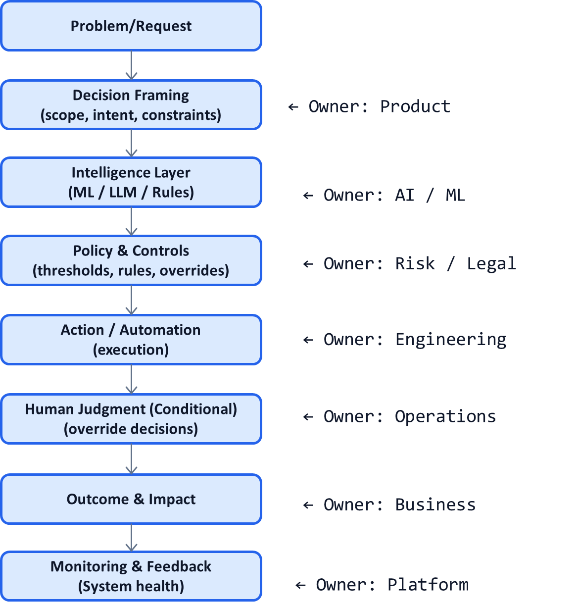

# AI System Diagnostic Pattern P13: AI Ownership and Seam Mapping

## Problem

When AI systems fail, teams often ask:
- “Which model broke?”
- “Which vendor caused this?”
- “Why did accuracy drop?”

In practice, most failures do **not** originate inside models.  
They occur at **seams**—the boundaries between teams, components, decisions, and responsibilities.

When ownership is fragmented or implicit:
- Failures are detected late
- Accountability is unclear
- Fixes are reactive and political
- The same issues recur across use cases

---

## Context

This pattern is critical in:
- Enterprise AI platforms (P11)
- Cross-functional AI systems
- Regulated decision workflows
- Agentic systems spanning multiple tools

It becomes visible when:
- “This wasn’t my responsibility” appears in postmortems
- Incidents span multiple teams
- Fixes require coordination rather than code changes
- Risk and compliance are involved after the fact

---

## Core Insight

**AI failures happen at seams, not components.**

A seam is where:
- Decisions hand off between layers
- Responsibility shifts between teams
- Signals are transformed or interpreted
- Assumptions silently change

Explicit ownership of seams prevents most production failures.

---

## AI System Diagnostic Diagram 

This pattern overlays **ownership boundaries** on the canonical system.

**Key annotation:**
Failures emerge where **ownership changes**, not where boxes exist.

---

## How Seam Mapping Works

### Step 1 — Identify Seams

Typical seams include:

* Framing → Model (problem misunderstood)
* Model → Policy (signals misinterpreted)
* Policy → Action (rules misapplied)
* Automation → Human (unclear escalation)
* Outcome → Monitoring (feedback not captured)

Each seam is a potential failure point.

---

### Step 2 — Assign Explicit Owners

For every seam, define:

* Who owns correctness
* Who owns risk
* Who owns change approval
* Who is paged when it breaks

Ownership must be **named**, not implied.

---

### Step 3 — Define Contracts at Seams

Contracts include:

* Expected inputs and outputs
* Error semantics
* Confidence interpretation
* Escalation criteria
* Audit evidence requirements

Contracts reduce ambiguity under stress.

---

### Step 4 — Monitor the Seams

Track:

* Hand-off latency
* Override frequency
* Policy violations
* Drift between layers
* Disagreements across signals

Most leading indicators live at seams.

---

## Control Points (What Must Be Explicit)

A seam-aware system defines:

* RACI per system layer
* Decision rights per policy
* Escalation paths
* Incident ownership
* Change management rules

If these are undocumented, incidents will be political.

---

## Failure Modes if Ignored

When seam ownership is unclear:

* Teams blame models
* Root causes are misdiagnosed
* Fixes are local, not systemic
* Trust between teams erodes
* AI initiatives stall or get shut down

These failures repeat across organizations.

---

## Maturity Levels

**Level 1 – Component Ownership**

* Teams own boxes
* No one owns hand-offs

**Level 2 – Partial Seam Awareness**

* Some interfaces defined
* Ownership still fuzzy

**Level 3 – Seam-Owned System**

* Explicit seam ownership
* Contracts and monitoring
* Fast, coordinated response

High-performing AI organizations operate at Level 3.

---

## Reusable Across

This pattern applies to:

* Enterprise AI platforms
* Multi-team AI products
* Regulated decision systems
* Agentic AI architectures
* Vendor-integrated solutions

Anywhere AI spans more than one team.

---

## Why This Pattern Compounds

Seam mapping:

* Prevents systemic failures
* Speeds incident resolution
* Clarifies accountability
* Improves cross-team trust
* Enables safer scaling of AI platforms

This is often the **hidden differentiator** between successful and stalled AI programs.

---

## One-Sentence Summary

> **AI failures rarely originate in models—they emerge at seams where ownership, assumptions, and accountability are unclear.**

