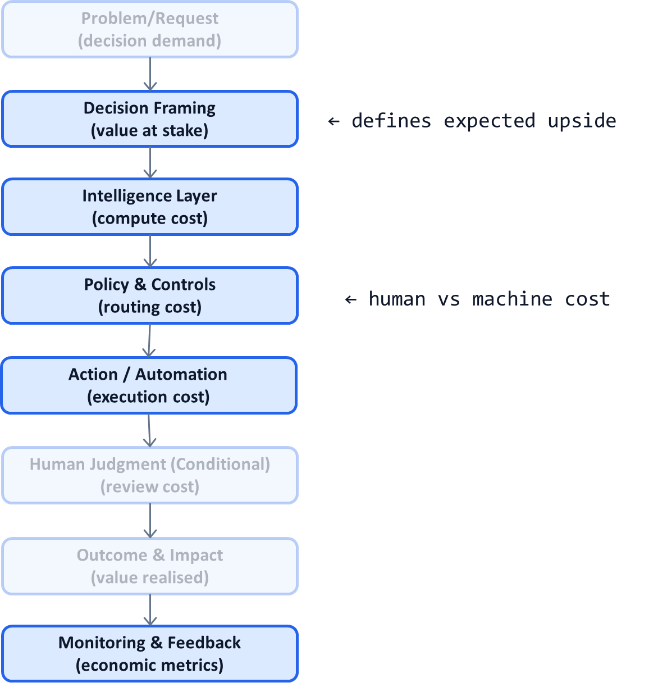

# AI System Diagnostic Pattern P14: Unit Economics per Decision

## Problem

Many AI initiatives cannot answer a basic question:

> “Is this decision economically worth automating?”

Common symptoms:
- AI accuracy improves, but costs are unclear
- LLM usage grows without predictable spend
- Human review costs are hidden or misattributed
- ROI discussions happen only after deployment

When AI economics are opaque, organizations either:
- Over-automate and overspend, or
- Under-invest and stall promising systems

---

## Context

This pattern is critical in:
- Enterprise AI platforms (P11)
- LLM-based systems with variable costs
- High-volume decision workflows
- Portfolios with multiple AI use cases competing for resources

It becomes visible when:
- Finance asks for cost predictability
- Leadership compares AI use cases
- Teams argue about which system to scale next
- Automation decisions feel subjective

---

## Core Insight

**AI value is realized one decision at a time.**

The correct economic unit is not:
- A model
- A pipeline
- A project

It is a **single decision**, with explicit:
- Cost
- Value
- Risk

Systems that measure unit economics can scale rationally.

---

## AI System Diagnostic Diagram 

This pattern overlays **cost and value attribution** across the decision flow.

**Key annotation:**
Every decision emits both **cost signals** and **value signals**.

---

## How the Pattern Works

### Step 1 — Define Cost per Decision

Include:

* Model inference cost (tokens, compute)
* Data access and retrieval cost
* Human review cost (time × rate)
* Infrastructure and platform overhead

Costs must be **fully loaded**, not estimated.

---

### Step 2 — Define Value per Decision

Depending on domain:

* Revenue gained
* Cost avoided
* Risk reduced
* Time saved
* Compliance exposure lowered

Value may be probabilistic—but it must be estimated explicitly.

---

### Step 3 — Segment Decisions by Economics

Not all decisions are equal:

* High-value, low-volume
* Low-value, high-volume
* High-risk, irreversible
* Low-risk, reversible

Each segment deserves different automation and investment strategies.

---

### Step 4 — Tie Economics to Policy

Use unit economics to drive:

* Automation thresholds (P02)
* Confidence routing (P09)
* Human-in-the-loop placement (P05)
* Degradation strategies (P10)

Economics become a **control signal**, not a report.

---

## Control Points (What Must Be Explicit)

A system implementing this pattern must define:

* Cost attribution methodology
* Value estimation assumptions
* Decision segmentation
* Acceptable cost–value ratios
* Ownership of economic tuning

If economics are debated post-hoc, the system is unmanaged.

---

## Failure Modes if Ignored

Without unit economics:

* AI systems scale irrationally
* Cheap decisions consume expensive models
* Human review is overused or underused
* Finance blocks expansion
* Strategic prioritization is impossible

These systems lose executive sponsorship.

---

## Maturity Levels

**Level 1 – Aggregate Economics**

* Project-level ROI
* No per-decision visibility

**Level 2 – Partial Unit Economics**

* Some cost tracking
* Incomplete value modeling

**Level 3 – Decision-Level Economics**

* Cost and value per decision
* Segmentation-driven policies
* Predictable scaling

Scalable AI portfolios require Level 3.

---

## Reusable Across

This pattern applies to:

* LLM-powered workflows
* Fraud and risk systems
* Claims and coding
* Content moderation
* Recommendation engines
* Enterprise automation platforms

Anywhere decisions repeat at scale.

---

## Why This Pattern Compounds

Unit economics per decision:

* Enables rational scaling
* Aligns AI with business value
* Simplifies portfolio prioritization
* Strengthens trust with finance and leadership
* Turns AI from cost center into managed asset

This pattern often unlocks **second-order investment**.

---

## One-Sentence Summary

> **AI systems scale sustainably only when cost, value, and risk are measured and managed at the level of individual decisions.**

