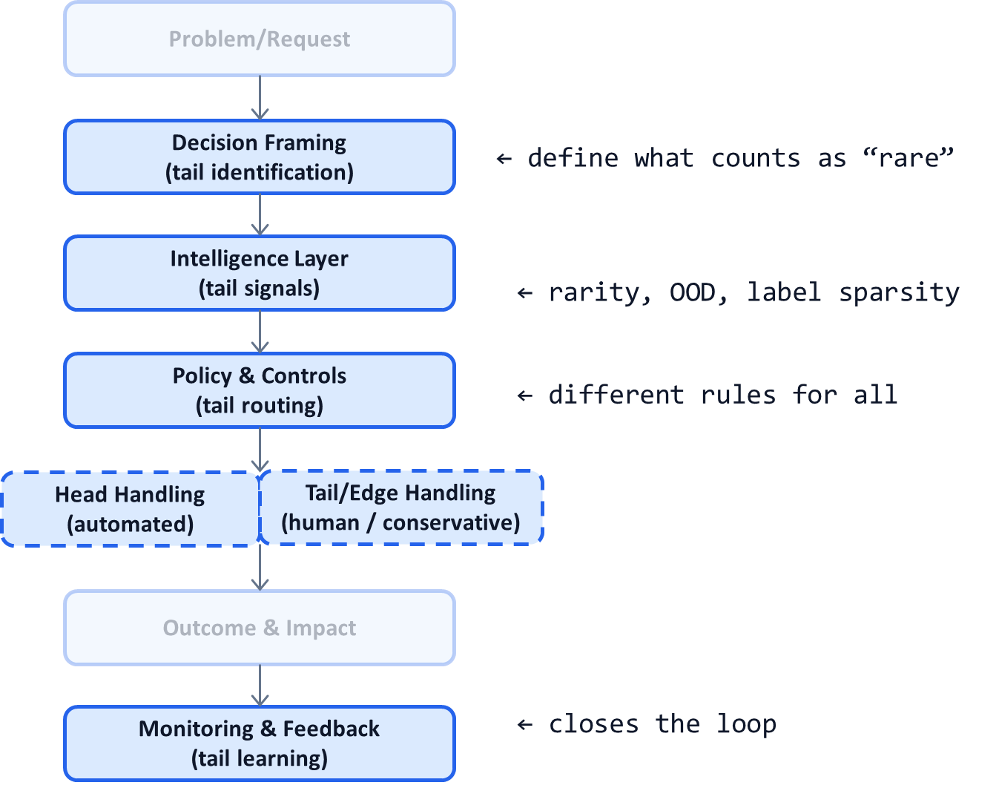

# AI System Diagnostic Pattern P15: Long-Tail and Edge-Case Handling

## Problem

AI systems are usually optimized for the **average case**:
- Most frequent labels
- Common workflows
- Typical inputs

Yet in production:
- A small fraction of cases consumes most human time
- Rare errors create outsized legal, financial, or reputational damage
- Trust is lost due to a handful of edge failures, not overall accuracy

Ignoring the long tail makes AI systems look good in metrics and fail in reality.

---

## Context

This pattern is critical in:
- Healthcare, insurance, and finance
- Compliance-heavy workflows
- Multi-label or extreme classification problems
- High-volume systems with uneven error costs

It becomes visible when:
- Human queues are dominated by “weird” cases
- Accuracy is high but escalations persist
- Incidents trace back to rare combinations
- Teams say “this only happens 0.1% of the time”

That 0.1% is usually where the system breaks.

---

## Core Insight

**In decision systems, the long tail determines trust and cost—not the head.**

Most value comes from automating the head.  
Most risk and operational burden live in the tail.

High-leverage systems **design explicitly for the tail** instead of hoping models learn it.

---

## AI System Diagnostic Diagram 

This pattern routes **rare and ambiguous cases** differently from the start.

**Key annotation:**
The system treats *head* and *tail* as different products with different economics.

---

## How the Pattern Works

### Step 1 — Define the Tail Explicitly

Tail signals may include:

* Rare labels or combinations
* Low data support
* High disagreement between models
* Out-of-distribution indicators
* Novel inputs or formats

If “tail” is undefined, it will overwhelm operations.

---

### Step 2 — Segment Head vs Tail Paths

* **Head cases:**
  High confidence, frequent, low risk → aggressive automation

* **Tail cases:**
  Low confidence, rare, high impact → conservative handling

This segmentation prevents tail cases from polluting head optimization.

---

### Step 3 — Design Tail-Specific Handling

Tail strategies include:

* Specialized human expertise
* Rule-based safeguards
* Slower but safer workflows
* Targeted data collection
* Active learning loops

The goal is **containment**, not full automation.

---

### Step 4 — Learn from the Tail Selectively

Not all tail cases should be learned equally.

* Some tails disappear with data
* Some remain inherently rare
* Some should never be automated

Learning strategy must be intentional, not reactive.

---

## Control Points (What Must Be Explicit)

A tail-aware system defines:

* What constitutes a tail case
* Separate SLAs for head vs tail
* Cost tolerance for tail handling
* Risk tolerance for tail automation
* Ownership of tail learning strategy

If tail costs surprise teams, this was not explicit.

---

## Failure Modes if Ignored

Without tail-aware design:

* Human queues are dominated by edge cases
* Automation gains plateau early
* Rare errors cause disproportionate harm
* Models overfit the head
* Trust erodes despite strong metrics

These systems stall at partial automation.

---

## Maturity Levels

**Level 1 – Head-Only Optimization**

* Average metrics look good
* Tail overwhelms operations

**Level 2 – Reactive Tail Handling**

* Ad-hoc escalations
* Inconsistent treatment

**Level 3 – Tail-Explicit Design**

* Separate paths
* Clear economics
* Intentional learning

Production-grade systems require Level 3.

---

## Reusable Across

This pattern applies to:

* Medical coding and claims
* Fraud and anomaly detection
* Content moderation
* Search and recommendation
* Risk and eligibility engines
* Agentic AI workflows

Anywhere rare cases matter more than averages.

---

## Why This Pattern Compounds

Tail-aware systems:

* Unlock higher automation safely
* Reduce operational surprises
* Improve trust with stakeholders
* Focus learning where it matters
* Complement P05, P09, and P14 directly

Most AI ROI plateaus disappear once the tail is handled correctly.

---

## One-Sentence Summary

> **In production AI, the long tail—not the average case—determines cost, risk, and trust.**

