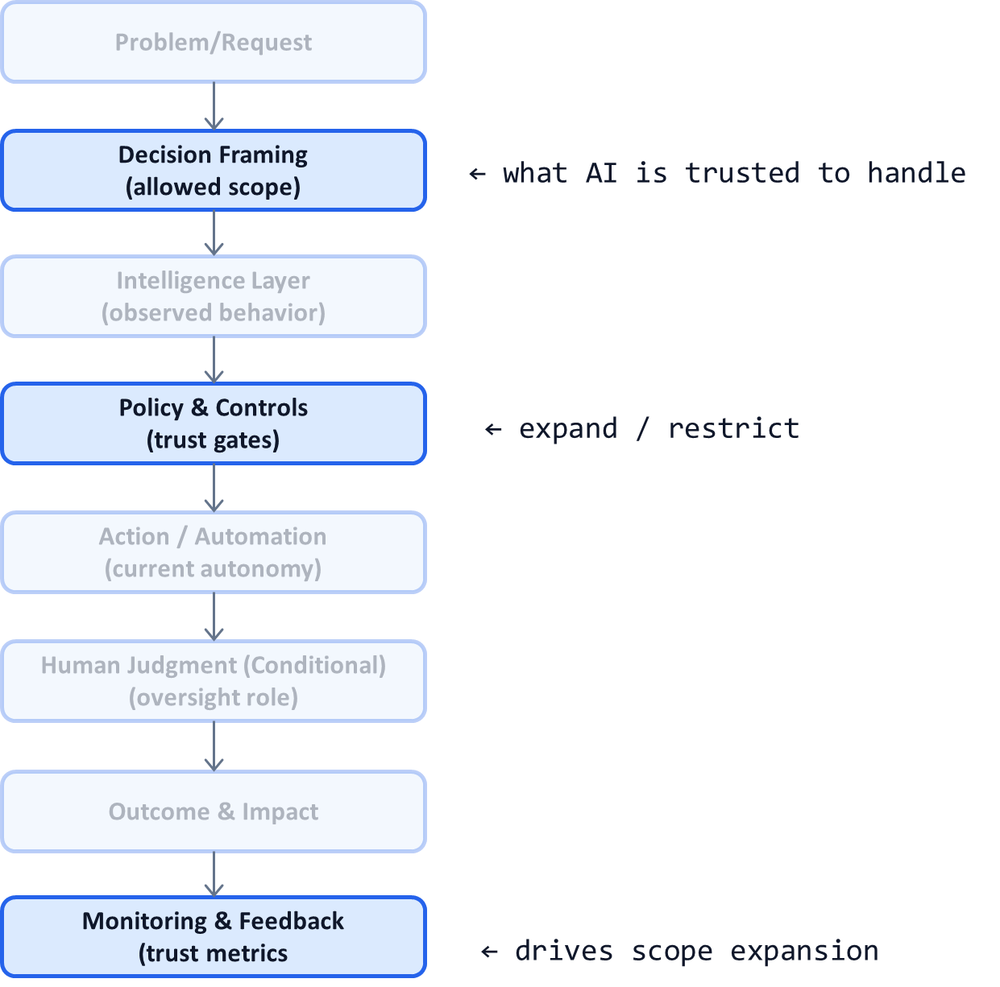

# AI System Diagnostic Pattern P16: Progressive Trust and Scope Expansion

## Problem

Many AI systems fail not because they are inaccurate, but because they are **given too much authority too soon**.

Common failure modes:
- Early over-automation triggers incidents
- Trust collapses after rare failures
- AI is permanently constrained after one mistake
- Teams cannot justify expanding scope safely

Trust is treated as an emotional reaction instead of a **designed system property**.

---

## Context

This pattern is essential in:
- High-stakes decision systems
- Regulated environments
- LLM-based agents evolving toward autonomy
- Organizations introducing AI into critical workflows

It becomes visible when:
- Leaders ask “Can we trust this yet?”
- Automation is frozen after incidents
- Teams argue over expanding AI scope
- Governance feels arbitrary or political

---

## Core Insight

**Trust must be earned incrementally through demonstrated behavior.**

AI systems should expand:
- Decision authority
- Coverage
- Autonomy

only when they meet **predefined, observable criteria**.

Trust is a control mechanism—not a feeling.

---

## AI System Diagnostic Diagram 

This pattern makes **scope and authority explicit control variables** in the system.

**Key annotation:**
Trust is managed by **policy gates informed by observed outcomes**, not gut feel.

---

## How the Pattern Works

### Step 1 — Define Initial Trust Scope

Start narrowly:

* Limited decision types
* Conservative thresholds
* Mandatory human review
* Explicit exclusions

The goal is **safe learning**, not speed.

---

### Step 2 — Define Trust Metrics

Examples:

* Accuracy within confidence bands
* Override frequency
* Incident rate
* Cost predictability
* Audit completeness

Metrics must reflect **system behavior**, not just model performance.

---

### Step 3 — Encode Trust Gates

Define clear conditions for:

* Expanding automation
* Increasing coverage
* Reducing human review
* Enabling new actions

These gates live in **Policy & Controls**, not in meetings.

---

### Step 4 — Expand Scope Incrementally

Expand one dimension at a time:

* More decision types
* Higher automation rates
* Faster execution
* Broader user base

Reversibility is critical (see P10).

---

## Control Points (What Must Be Explicit)

A trust-driven system defines:

* Current trust level
* Allowed scope at each level
* Metrics required to advance
* Authority to approve expansion
* Rollback criteria

If expansion debates are subjective, trust was not designed.

---

## Failure Modes if Ignored

Without progressive trust:

* Systems scale prematurely
* Incidents freeze innovation
* Trust decisions become political
* Teams oscillate between over- and under-automation
* AI adoption stagnates

These systems rarely mature.

---

## Maturity Levels

**Level 1 – Static Trust**

* Fixed automation level
* No expansion logic

**Level 2 – Ad-Hoc Trust**

* Manual approvals
* Inconsistent criteria

**Level 3 – Progressive Trust**

* Explicit gates
* Measured expansion
* Reversible decisions

Sustainable AI systems operate at Level 3.

---

## Reusable Across

This pattern applies to:

* Regulated AI systems
* Enterprise automation
* Agentic AI platforms
* Customer-facing AI products
* Internal decision-support tools

Anywhere trust must be earned and defended.

---

## Why This Pattern Compounds

Progressive trust:

* Prevents catastrophic early failures
* Preserves long-term autonomy
* Aligns AI growth with organizational comfort
* Enables faster expansion once trust is earned
* Complements P02, P06, and P10 directly

This pattern often determines **whether AI adoption accelerates or stalls**.

---

## One-Sentence Summary

> **Trust in AI systems should expand only when predefined evidence shows the system has earned more authority.**

