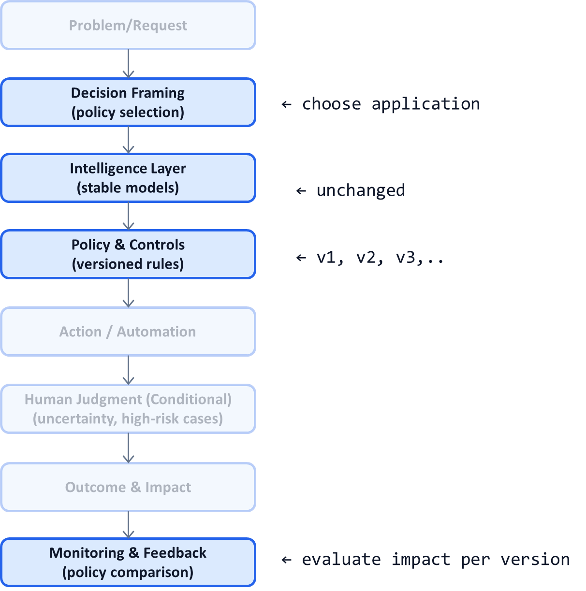

# AI System Diagnostic Pattern P17: Policy Versioning with Stable Models

## Problem

In many AI systems, **policy changes are treated as model changes**:
- Threshold tweaks require retraining
- Compliance updates trigger prompt rewrites
- Business rule changes cause regressions
- Historical decisions become hard to interpret

This creates slow iteration, brittle systems, and audit confusion—especially in regulated environments.

---

## Context

This pattern is critical in:
- Regulated decision systems
- Enterprise AI platforms (P11)
- LLM-based systems with frequent rule changes
- Long-lived AI products with audit requirements

It becomes visible when:
- “We need to retrain” is the default response to a rule change
- Different teams apply rules inconsistently
- Historical decisions cannot be explained after updates
- Innovation slows due to fear of breaking compliance

---

## Core Insight

**Policies should evolve faster than models.**

Models generate intelligence.  
Policies encode organizational intent, rules, and risk tolerance.

Treating policy as versioned, first-class configuration allows systems to adapt without destabilizing intelligence.

---

## AI System Diagnostic Diagram 

This pattern hardens the **Policy & Controls** layer as a versioned system independent of models.

**Key annotation:**
Policies are selected and enforced dynamically; models remain stable.

---

## How the Pattern Works

### Step 1 — Externalize Policy Completely

Policies must live outside:

* Model weights
* Training data
* Prompts
* Application code

They should be expressed as:

* Declarative rules
* Threshold tables
* Configured routing logic

---

### Step 2 — Version Policies Explicitly

Each policy change creates:

* A new version identifier
* A changelog
* An effective date
* Rollback capability

Historical decisions reference the policy version used at the time.

---

### Step 3 — Support Parallel Policy Execution

Enable:

* Shadow evaluation of new policies
* A/B testing policy versions
* Gradual rollout by segment

This allows safe iteration without affecting production outcomes prematurely.

---

### Step 4 — Compare Outcomes Across Versions

Use monitoring to track:

* Automation rates
* Error patterns
* Cost and latency
* Human override frequency
* Risk exposure

Policy iteration becomes **evidence-driven**.

---

## Control Points (What Must Be Explicit)

A policy-versioned system defines:

* Who can create or approve policies
* Which decisions require which policy versions
* How conflicts between policies are resolved
* Rollback criteria and authority
* Audit linkage between decision and policy version

If policies change without traceability, audits will fail.

---

## Failure Modes if Ignored

Without policy versioning:

* Rule changes break systems unexpectedly
* Historical decisions cannot be defended
* Model retraining becomes overused
* Teams avoid improvement
* Compliance risk accumulates silently

These systems stagnate or get shut down.

---

## Maturity Levels

**Level 1 – Implicit Policy**

* Rules embedded in code or prompts
* No versioning

**Level 2 – Partially Externalized**

* Some config-driven rules
* Limited traceability

**Level 3 – Fully Versioned Policy**

* Independent lifecycle
* Parallel testing
* Full audit linkage

Durable AI systems operate at Level 3.

---

## Reusable Across

This pattern applies to:

* Compliance-heavy domains
* Credit and eligibility systems
* Pricing and moderation
* LLM-based decision platforms
* Enterprise AI governance

Anywhere rules evolve faster than intelligence.

---

## Why This Pattern Compounds

Policy versioning:

* Accelerates safe iteration
* Preserves historical explainability
* Reduces unnecessary retraining
* Enables rapid response to regulation
* Strengthens trust with auditors and leadership

It is a cornerstone of long-lived AI systems.

---

## One-Sentence Summary

> **Stable models with versioned, auditable policies allow AI systems to adapt quickly without breaking trust or traceability.**

