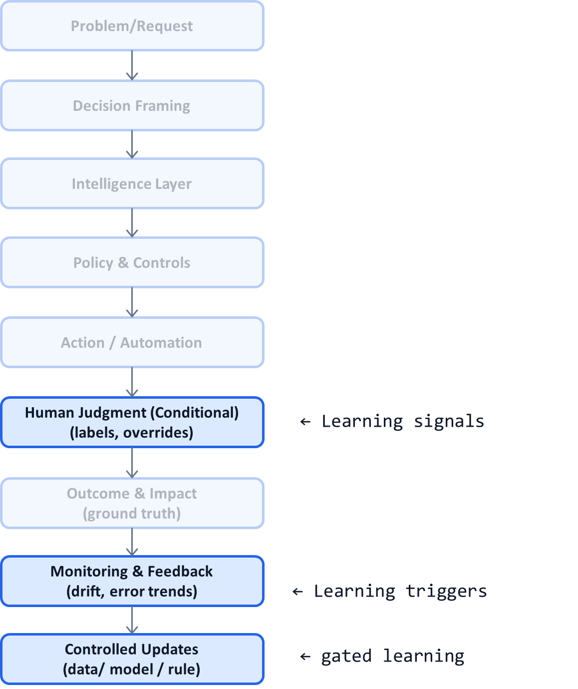

# AI System Diagnostic Pattern P18: Post-Deployment Learning Loops

## Problem

Many AI systems stop learning once they are deployed:
- Models are trained once and left unchanged
- Feedback from humans is not captured systematically
- Errors are fixed manually and locally
- Improvements depend on ad-hoc retraining cycles

As a result:
- Performance degrades silently
- Edge cases accumulate
- Trust erodes despite “stable” systems
- Learning lags behind real-world change

AI that does not learn post-deployment becomes obsolete.

---

## Context

This pattern is critical in:
- Long-lived AI systems
- High-volume decision workflows
- Environments with concept or data drift
- Systems with human-in-the-loop components

It becomes visible when:
- Override rates increase over time
- Model accuracy decays despite no code changes
- Teams cannot explain why performance dropped
- Retraining decisions are reactive and urgent

---

## Core Insight

**Learning in production must be deliberate, gated, and auditable.**

Post-deployment learning is not:
- Continuous auto-training
- Blind reinforcement
- Silent weight updates

It is a **controlled loop** that converts outcomes and human feedback into system improvements—without breaking trust.

---

## AI System Diagnostic Diagram 

This pattern closes the loop between **Outcome**, **Monitoring**, and **System Updates**.

**Key annotation:**
Learning flows back only through **explicit, gated update paths**.

---

## How the Pattern Works

### Step 1 — Capture Learning Signals

Sources include:

* Human overrides and rationales
* Post-decision outcomes
* Appeals or corrections
* Drift and error diagnostics

Feedback must be **structured**, not free text.

---

### Step 2 — Classify What Should Learn

Not all feedback updates the model:

* Some inform policy changes (P17)
* Some require better routing (P09)
* Some indicate tail cases (P15)
* Some justify retraining

Learning targets must be chosen intentionally.

---

### Step 3 — Gate Updates Explicitly

Before updates occur, define:

* Required evidence thresholds
* Safety and bias checks
* Offline validation steps
* Rollout and rollback plans

Learning is **approved**, not automatic.

---

### Step 4 — Validate in Shadow Mode

New learning is tested via:

* Offline evaluation
* Shadow deployment
* A/B comparisons

Production behavior changes only after validation.

---

## Control Points (What Must Be Explicit)

A post-deployment learning system defines:

* What counts as ground truth
* Who approves learning updates
* Which components may change
* Update frequency limits
* Audit linkage from outcome to update

If learning cannot be explained later, it should not occur.

---

## Failure Modes if Ignored

Without controlled learning loops:

* Models drift silently
* Humans compensate informally
* Errors repeat across cycles
* Trust decays gradually
* Emergency retraining becomes common

These systems feel stable—until they are not.

---

## Maturity Levels

**Level 1 – Static Deployment**

* No learning
* Manual fixes

**Level 2 – Reactive Learning**

* Ad-hoc retraining
* Weak traceability

**Level 3 – Controlled Learning Loops**

* Structured feedback
* Gated updates
* Full audit trail

Sustainable AI systems operate at Level 3.

---

## Reusable Across

This pattern applies to:

* Regulated AI systems
* Human-in-the-loop workflows
* LLM-based agents
* Recommendation systems
* Enterprise decision platforms

Anywhere the world changes faster than models.

---

## Why This Pattern Compounds

Controlled learning loops:

* Preserve long-term accuracy
* Reduce emergency interventions
* Improve human trust
* Enable safe evolution
* Complement P10, P15, and P17 directly

This pattern keeps AI systems **alive and improving**.

---

## One-Sentence Summary

> **Production AI must learn from real outcomes—but only through controlled, auditable, and reversible loops.**

