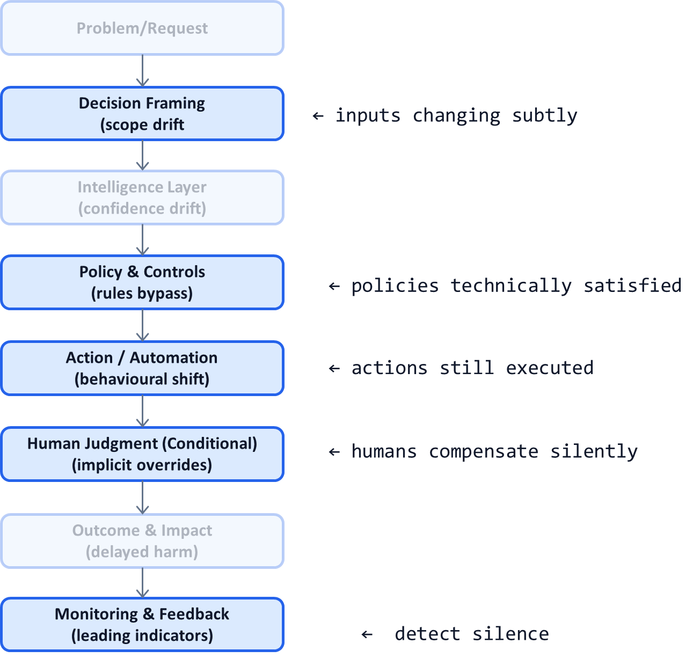

# AI System Diagnostic Pattern P19: Silent Failure Detection

## Problem

The most damaging AI failures are not loud crashes or obvious errors.

They are **silent failures**:
- Metrics look healthy
- Systems keep running
- No alerts are triggered
- Trust erodes slowly
- Damage accumulates unnoticed

By the time silent failures are detected, the cost—financial, legal, or reputational—is already paid.

---

## Context

This pattern is critical in:
- High-volume production AI
- Regulated and audited decision systems
- Long-lived AI platforms
- Agentic systems operating continuously

It becomes visible when:
- Outcomes worsen despite “green dashboards”
- Humans increasingly override AI without escalation
- Customer complaints rise without clear technical signals
- Postmortems reveal issues that monitoring missed

---

## Core Insight

**Most AI failures are behavioral, not technical.**

Silent failures occur when:
- Models remain accurate on old metrics
- But decisions drift away from intended outcomes
- Or system behavior changes subtly over time

Detecting these failures requires **leading indicators**, not traditional performance metrics.

---

## AI System Diagnostic Diagram 

This pattern instruments **behavioral signals across the entire decision flow**, not just the model.

**Key annotation:**
Silent failures manifest as **behavioral drift across layers**, not metric collapse in one box.

---

## How Silent Failures Arise

Common sources include:

* Distribution shift without label availability
* Policy loopholes exploited by edge cases
* Humans adapting behavior to “work around” AI
* Cost pressures changing routing subtly
* New use cases stretching original intent

The system keeps “working”—but no longer doing the right thing.

---

## How the Pattern Works

### Step 1 — Identify Leading Indicators

Examples:

* Increase in human overrides without incidents
* Changes in decision mix or routing paths
* Rising time-to-resolution
* Cost-per-decision creep
* Divergence between confidence and outcomes

These signal **behavioral drift** before harm is obvious.

---

### Step 2 — Monitor Cross-Layer Consistency

Track alignment between:

* Model confidence vs human trust
* Policy intent vs actual decisions
* Automation rates vs error exposure
* Tail volume vs baseline assumptions

Misalignment is often the first warning.

---

### Step 3 — Define Silence Thresholds

Explicitly specify:

* What “too quiet” looks like
* When stable metrics become suspicious
* How long drift can persist before escalation

Silence itself becomes an alert condition.

---

### Step 4 — Trigger Investigative Loops

When silent failure signals fire:

* Reduce automation (P10)
* Escalate to human review (P05)
* Audit recent decisions (P07)
* Re-evaluate policies (P17)
* Feed learning loops (P18)

Response must be **systemic**, not ad-hoc.

---

## Control Points (What Must Be Explicit)

A silent-failure-aware system defines:

* Behavioral health metrics
* Cross-layer alignment checks
* Escalation ownership
* Investigation playbooks
* Recovery criteria

If detection relies on intuition, it is too late.

---

## Failure Modes if Ignored

Without silent failure detection:

* AI appears stable until crisis
* Damage accumulates invisibly
* Incidents feel “sudden”
* Trust collapses abruptly
* AI adoption is rolled back broadly

Most AI reputational damage comes from this pattern being absent.

---

## Maturity Levels

**Level 1 – Reactive Detection**

* Incidents discovered externally
* Metrics-only monitoring

**Level 2 – Partial Behavioral Signals**

* Some override or cost tracking
* No formal thresholds

**Level 3 – Silent Failure–Aware**

* Leading indicators
* Cross-layer monitoring
* Automatic escalation

Production-grade AI systems require Level 3.

---

## Reusable Across

This pattern applies to:

* Regulated decision systems
* High-volume AI platforms
* LLM agents
* Recommendation engines
* Enterprise automation

Anywhere AI can be “mostly right” and still harmful.

---

## Why This Pattern Compounds

Silent failure detection:

* Prevents reputational disasters
* Preserves long-term trust
* Enables higher baseline automation
* Reduces surprise incidents
* Completes the governance and learning loop

This pattern is the **last line of defense**.

---

## One-Sentence Summary

> **The most dangerous AI failures are the ones that look like success—silent failure detection turns behavioral drift into an explicit signal.**

