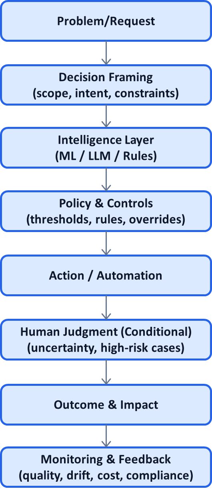

# AI System Pattern P00: Why Patterns, Not Models

## Problem

Most AI efforts over-invest in **models** and under-invest in **system design**.

Teams argue about:
- Which architecture to use
- Which LLM is best
- How to squeeze another 1–2% accuracy

Yet in production, AI systems fail not because the model was weak, but because:
- Decisions were poorly framed
- Human judgment was misplaced
- Risk was implicit instead of designed
- Ownership was unclear
- Economics did not work at scale

This creates brittle systems that perform well in demos and poorly in reality.

---

## Context

This problem appears consistently across:
- Regulated domains (healthcare, finance, insurance)
- Enterprise AI platforms
- Decision-heavy workflows (claims, approvals, moderation, compliance)

It is most visible **after deployment**, when the cost of fixing architectural mistakes is highest.

---

## Core Insight

**Models change quickly. Decision systems do not.**

Reusable value in AI does not come from choosing the “right” model.  
It comes from designing **stable patterns for how intelligence is applied to decisions under uncertainty**.

Patterns outlive models.  
Systems compound.  
Architectural mistakes scale faster than model errors.

---

## AI System Diagnostic Diagram 

---

## How It Works

Reusable AI system patterns:
1. Abstract away the model
2. Focus on decision flow and control points
3. Make risk, cost, and accountability explicit
4. Define where humans must intervene
5. Design for evolution, not perfection

A pattern can be reused even when:
- The model changes
- The vendor changes
- The domain changes

This makes patterns **portable, defensible, and compounding**.

---

## Control Points

Patterns deliberately expose:
- Decision boundaries (what is automated vs reviewed)
- Confidence thresholds
- Override mechanisms
- Audit and traceability hooks
- Cost and latency trade-offs

If these are implicit, the system is fragile.  
If they are explicit, the system is governable.

---

## Failure Modes if Ignored

When teams focus on models instead of patterns:
- AI works in pilots but fails at scale
- Humans are overloaded or bypassed
- Risk is discovered only after incidents
- Trust erodes with stakeholders
- Each new use case is rebuilt from scratch

These failures are **systemic**, not technical.

---

## Maturity Levels

**Level 1 – Model-Centric**
- Success measured by accuracy
- Manual processes wrap the model
- High fragility

**Level 2 – System-Aware**
- Decision flow is explicit
- Humans placed intentionally
- Risk partially controlled

**Level 3 – Pattern-Driven**
- Reusable architectures
- Stable decision logic
- Models become interchangeable components

High-leverage organizations operate at Level 3.

---

## Reusable Across

This framing applies to:
- Classical ML and LLM systems
- Assistive and autonomous AI
- Internal tools and customer-facing products
- Startups and large enterprises

Anywhere AI makes or influences decisions.

---

## Why This Pattern Compounds

Patterns create leverage because:
- They shorten future design cycles
- They reduce repeated mistakes
- They enable earlier executive trust
- They shift conversations from “can we build this?” to “should we do this?”

Owning patterns moves you from **builder** to **architect**,  
from **execution** to **control**.

---

## One-Sentence Summary

> **In AI, models are replaceable. Patterns are not. The real advantage comes from reusable ways of applying intelligence to decisions safely, economically, and at scale.**
