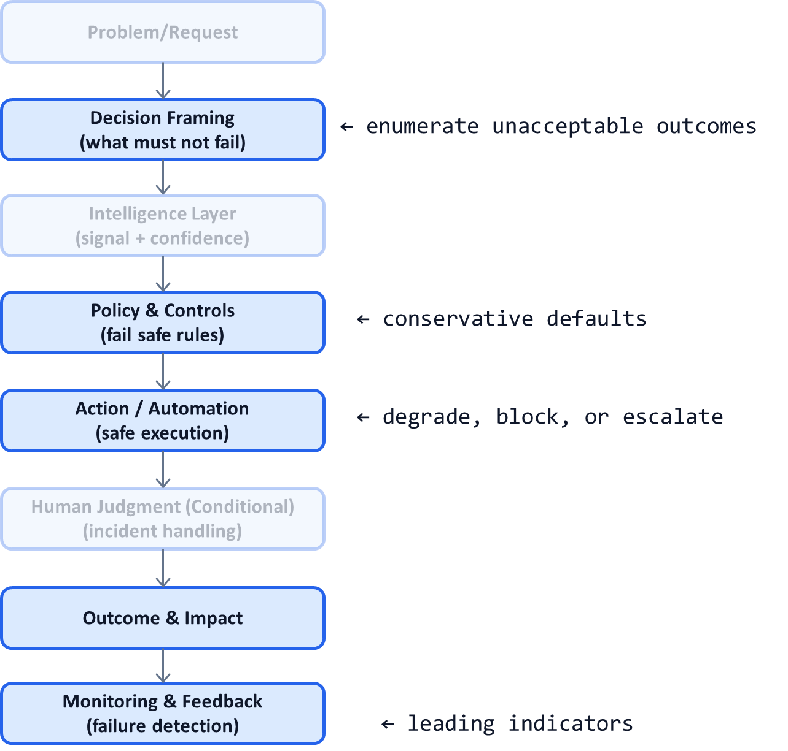

# AI System Pattern P06: Failure-Mode–First AI Architecture

## Problem

Most AI systems are designed by asking:
- “What should the system do?”
- “How do we improve accuracy?”

This leads to systems that perform well in normal conditions but fail **silently and catastrophically** in edge cases.

In high-stakes environments, the most dangerous failures are not frequent errors—they are **rare, high-impact failures** discovered too late.

---

## Context

This pattern is essential in:
- Regulated or safety-critical domains
- High-volume decision systems
- AI systems influencing irreversible actions
- LLM-based agents with tool access

It becomes visible when:
- Incidents are discovered by customers or auditors
- “This was extremely rare” is used as a defense
- Monitoring shows green metrics while outcomes degrade
- Teams cannot explain how failure was supposed to be detected

---

## Core Insight

**Design AI systems by first asking what must never go wrong.**

Failure modes should be:
- Enumerated explicitly
- Designed against deliberately
- Detectable early
- Recoverable safely

A system that fails loudly and safely is superior to one that fails quietly and accurately.

---

## AI System Diagnostic Diagram 

This pattern reshapes the system by **pulling failure thinking upstream** and **instrumenting detection downstream**.

**Key annotation:**
Failure detection and safe response are first-class system components—not afterthoughts.

---

## How the Pattern Works

### Step 1 — Enumerate Failure Modes

Ask:

* What outcome would be unacceptable?
* What error would trigger legal, financial, or reputational damage?
* What failure would destroy trust even if rare?

Examples:

* Wrong denial of critical service
* Incorrect irreversible action
* Biased or non-compliant decision

---

### Step 2 — Design Fail-Safe Policies

For each failure mode:

* Define conservative thresholds
* Prefer false negatives over false positives
* Route to humans or block execution

This often **reduces apparent accuracy** but dramatically increases safety.

---

### Step 3 — Instrument Early Warning Signals

Monitor:

* Confidence drift
* Distribution shift
* Override frequency
* Latency spikes
* Policy violations

These are **leading indicators**, not lagging metrics.

---

### Step 4 — Define Safe Degradation Paths

When signals trip:

* Reduce automation level (P02)
* Escalate to humans (P05)
* Switch to simpler rules
* Halt execution if needed

A controlled slowdown is success, not failure.

---

## Control Points (What Must Be Explicit)

A failure-mode–first system defines:

* Unacceptable outcomes (in plain language)
* Detection thresholds
* Response actions
* Ownership during incidents
* Post-incident learning loops

If these are not documented, the system is unsafe.

---

## Failure Modes if Ignored

When systems are not designed this way:

* Failures are discovered externally
* Teams scramble reactively
* Blame shifts to models or vendors
* Automation is rolled back entirely
* Trust is lost permanently

These systems rarely recover.

---

## Maturity Levels

**Level 1 – Success-Optimized**

* Focus on accuracy
* Minimal monitoring
* Reactive incident response

**Level 2 – Risk-Aware**

* Some failure enumeration
* Manual interventions
* Partial detection

**Level 3 – Failure-Mode–First**

* Explicit unacceptable outcomes
* Instrumented detection
* Safe degradation paths
* Continuous learning

Production-grade AI requires Level 3.

---

## Reusable Across

This pattern applies to:

* Healthcare and insurance AI
* Financial decision systems
* Content moderation at scale
* Autonomous agents
* Enterprise AI platforms

Anywhere **rare failures matter more than average performance**.

---

## Why This Pattern Compounds

Failure-mode–first design:

* Prevents catastrophic incidents
* Builds regulator and executive trust
* Enables higher automation safely
* Reduces long-term risk costs
* Creates durable AI systems

This pattern often determines **which AI systems survive**.

---

## One-Sentence Summary

> **Design AI systems around the failures you cannot afford, not the accuracy you hope to achieve.**

